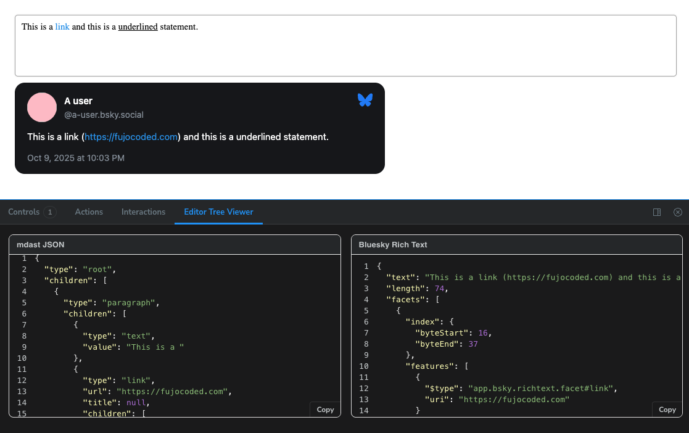

# Astrolabe

<div align="center">


Rich Text Editor, plugins, and content adapters for fandom and
ATmosphere-friendly editors.

<a href="https://pnpm.io/"></a> <a
href="https://www.typescriptlang.org/"></a> <a
href="https://tiptap.dev/"></a>

</div>

> [!WARNING]
>
> This project is mid-refactor/cleanup from a bunch of personal experiments and
> old code accumulated throughout the years. Expect some weirdness and
> less-than-ideal code here and there.

Astrolabe is a block-based Rich Text Editor which aims to provide a simple,
extensible, and modern text editing experience to be reused across projects and
provide a bridge across platforms.

It consists of two main parts:

- [Plugins](./plugins/), components that extend the [TipTap
  editor](https://tiptap.dev/docs) with new features and functionality.
- [Adapters](./adapters/), libraries to translate between the output of the
  editor and the API of modern social platforms, using
  [Remark/Mdast](https://github.com/remarkjs/remark) as a translation layer.

> [!NOTE]
>
> The adapters currently in this repo are focused on markdown + ATproto
> lexicons. With time, I'll be porting internal adapters I developed for APIs
> like Tumblr, Twitter, Mastodon etc.

## Check it in Action

Seeing is believing! The best way to see what makes Astrolabe cool right now, is
to see it at work on Storybook. In particular, check out:

- [Link and
  underline](https://astrolabe-editor.netlify.app/?path=/story/adapters-starter-bluesky--link-and-underline)
  translation to Bluesky post
- [Importing a Leaflet
  record](https://astrolabe-editor.netlify.app/?path=/story/adapters-starter-leaflet-from--base-lexicon) and editing on the fly

Make sure to open the "Editor Tree Viewer" panel to see what's happening under
the hood!



## Why Astrolabe exists

### A Modern Text Editor

The majority of social projects need a Rich Text Editor, whether to create
standalone posts or to chat with friends. This means that the higher the barrier
to create experiences that feature rich, full-featured _modern_ text editors is,
the harder it is to create a new social project. This difficulty impacts many on
the web:

- The type of less-technical developers [FujoCoded](https://fujocoded.com)
  builds for, who have less experience dealing with the quirks of text editing
- Fandom people as a whole, whose needs of self-expression deviate from the one
  you can find easily-packaged libraries for
- Everyone who has an idea for a social web project and needs to deal with Rich
  Text Experiences

Astrolabe plugins include:

- Inline spoilers (WIP in this repo)
- Mentions with cross-platform translation (in private repo)
- Conditional thread break (in private repo)
- Emoji picker (in private repo)
- Gif search (to be ported from old code)

### A Translation Layer for the Social Web

Similarly, a truly interconnected web needs a way to translate users' expression
across different walls—whether artificial or intended. While text input
capabilities are often similar across different platforms (within limitations),
parsing them from the platform's output or translating them to the platform's
input requires reimplementing the text editing experience from scratch.
Nevermind trying to bridge across different ones!

Astrolabe adapters can transform the input/output of the editor, as well as
independently translate text to and from:

- Markdown
- HTML
- Bluesky posts
- Leaflet documents
- Tumblr/Twitter/Mastodon API (in private repo)
- Tumblr/Twitter/Mastodon/Bluesky Playwright actions (in private repo)

## Examples (with adapters)

### Editor to Markdown

```typescript
import { convert as toMdast } from "@fujocoded/astdapters-mdast-starter";
import { toMarkdown } from "mdast-util-to-markdown";

const editorJson = editor.getJSON();
const mdastTree = toMdast(editorJson);
const markdown = toMarkdown(mdastTree);
```

### Editor to Bluesky

```typescript
import { convert as toBluesky } from "@fujocoded/astdapters-bluesky-starter";

const editorJson = editor.getJSON();
const post = await toBluesky(editorJson);

console.log(post.text.text); // Plain text body
console.log(post.text.facets); // Links, mentions, etc.
```

### Leaflet to Editor

```tsx
import { fromLeafletPost } from "@fujocoded/astdapters-leaflet-starter";
import StarterKit from "@tiptap/starter-kit";
import { EditorContent, useEditor } from "@tiptap/react";

function AstrolabeEditor() {
  const editor = useEditor({
    extensions: [StarterKit],
    content: fromLeafletPost(record.value.pages[0]),
  });
  return (
    <EditorContext.Provider value={{ editor }}>
      <EditorContent
        className="astrolabe-editor"
        editor={editor}
        role="presentation"
      />
    </EditorContext.Provider>
  );
}
```

## Monorepo tour

```
.
├── adapters/
│   └── adapter-starter/       Adapters for @tiptap/starter-kit
│       ├── mdast/              TipTap ⇆ mdast bridge
│       ├── bluesky/            TipTap → Bluesky Rich Text
│       └── leaflet/            TipTap → Leaflet posts
├── plugins/
│   └── inline-spoilers/       TipTap mark for spoiler text (WIP)
├── addons/
│   └── editor-tree-viewer/    Storybook addon to debug document output
└── storybook/                 Interactive playground + docs
```

## Local development

```bash
pnpm install    # bootstrap workspaces
pnpm build      # compile every package
pnpm dev        # watch-and-rebuild loop
pnpm test       # run tests
pnpm storybook  # open the storybook for plugins and adapters
```

Monorepo tasks are orchestrated through Turborepo. Scope commands with `pnpm
--filter` if you're only touching a single package.
